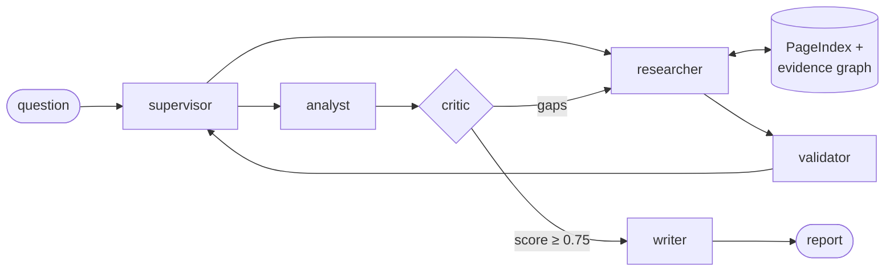

<picture>
  <source media="(prefers-color-scheme: dark)" srcset="assets/header-dark.svg">
  <source media="(prefers-color-scheme: light)" srcset="assets/header-light.svg">
  
</picture>

I'm Subodh, an AI engineer in India. I spent two years at Clarice Systems building AI systems for DRDO, India's defence research agency. Now I build tools that check what AI agents actually do.

**Open to AI engineer roles** in LLM agents, evaluation and RAG.

[Portfolio ↗](https://portfolio-one-wheat-38.vercel.app) &nbsp;&nbsp; [LinkedIn ↗](https://linkedin.com/in/subodh-sooby) &nbsp;&nbsp; [subodh00new@gmail.com](mailto:subodh00new@gmail.com)

Python · TypeScript · LangGraph · LangChain · FastAPI · Next.js · React · PostgreSQL · SQLite · MongoDB · ChromaDB · XGBoost · Docker

<br>

## ~/projects

### [RegShield](https://github.com/SubodhSenpai/RegShield)

Regression tests for agent behaviour. RegShield reads the execution trace (every thought, tool call and result) and fails CI when a prompt or model change makes an agent deploy before the tests run, or tell a user their refund went through when it never ran. The core checks are deterministic and run offline in milliseconds.

This is what a regression looks like:

```text
FAILED  deploy_gate  Tests before deploy  (composite 0.55)
  tool_selection          1.00
  argument_correctness    0.00
  call_ordering           0.00
  step_efficiency         1.00
  reasoning_faithfulness  1.00
  pattern checks: Policy PASS
Failures:
  - Argument correctness 0.00 < 0.85: deploy_production.env was 'prod',
    expected 'staging'
  - Call ordering 0.00 < 1.00: 'deploy_production' (step 1) ran before
    its prerequisite 'run_unit_tests' (step 2)
```

Python · works with LangChain, LangGraph, smolagents or your own loop · [regshield-lyart.vercel.app ↗](https://regshield-lyart.vercel.app)

### [DataLens](https://github.com/SubodhSenpai/Datalens)

Ask plain-English questions across uploaded CSV and Excel files. The model plans the query and a deterministic engine computes the answer, so every number arrives with a chart and the full trace behind it.

I grade it on generated data sets full of traps (padded headers, `9.5 lakh`, °F mixed with °C, `-999` sensor codes), where the generator also writes the answer key:

| data set | single file | across files |
|:--|:-:|:-:|
| HR and sales, 12 files | 11 / 11 | 13 / 15 |
| SaaS billing, 4 files | 11 / 11 | 18 / 21 |
| sensors, 32k readings | 11 / 11 | 20 / 24 |
| **total** | **33 / 33** | **51 / 60** |

Next.js · TypeScript · Recharts · [live demo ↗](https://datalens-six-rouge.vercel.app)

### [ResearchAgent](https://github.com/SubodhSenpai/ResearchAgent)

A research assistant built as a team of LangGraph agents. A supervisor plans sub-queries and routes the work. A researcher gathers evidence from the web and your documents, and a validator audits it for gaps and contradictions. A critic scores the analysis and sends it back for more research or another pass until it clears 0.75, capped at five rounds. Document retrieval is vectorless (PageIndex), and an SQLite evidence graph ties each claim to its source and flags claims that contradict each other.



FastAPI with SSE streaming · Next.js · [live ↗](https://research-agent-eight-rho.vercel.app)

## ~/work

**Clarice Systems** &nbsp;·&nbsp; software engineer on DRDO projects &nbsp;·&nbsp; 2024 to 2026<br>
Built threat-detection models (XGBoost) over binary data streams, and the operator console for a five-agent system that shows each agent's state, tool calls and findings. Took a slow query path from 12 s to under 3 s by reworking the queries and indexes. Demoed our systems to DRDO teams in Delhi.

**Ati Motors** &nbsp;·&nbsp; data engineer intern &nbsp;·&nbsp; Jan to Jun 2024<br>
Observability for a robot fleet (Grafana, PostgreSQL), failure and battery-wear analysis for early warnings, and a RAG assistant over Jira and Slack for tech support.

**IIIT Vadodara** &nbsp;·&nbsp; B.Tech, Computer Science &nbsp;·&nbsp; 2024<br>
Finalist at the Enigma national coding tournament (700+ teams). Co-founded the university table tennis club. Mentored 200+ students in full-stack and cloud.

## ~/reading

Forks I'm working through:

- [colibri](https://github.com/JustVugg/colibri) runs frontier MoE models on ordinary hardware by streaming experts from disk, in plain C. My way into inference engines.
- [crush](https://github.com/charmbracelet/crush), a terminal coding agent written in Go.
